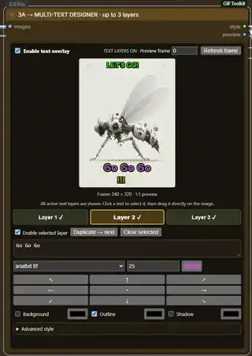
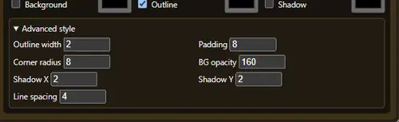
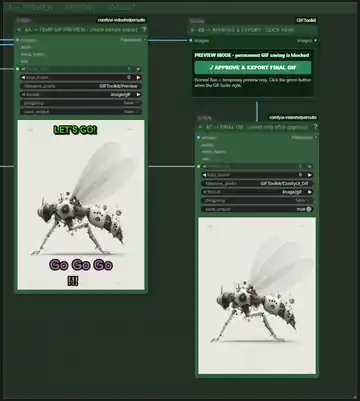

# ComfyUI-GIFToolkit

🌐 Language: **English** | [Deutsch](README_DE.md)

Create compact looping GIFs from short videos directly in ComfyUI, with preset sizing, visual multi-text placement, optional blinking, a preview-first export flow, and bilingual on-canvas help.

> **Status:** Version 0.4.0 is published to the ComfyUI Registry and can be installed through ComfyUI Manager.


---

## Overview

`ComfyUI-GIFToolkit` adds custom helper nodes and a ready-to-use workflow for short looping GIFs.

The workflow:

1. loads video through **VideoHelperSuite**
2. controls target size, aspect ratio, FPS and duration
3. supports up to **3 independent text layers**
4. previews the text and GIF before permanent output
5. writes the final GIF only after explicit approval

The text designer is visual: text can be clicked directly on the preview frame and dragged with the mouse.


## Requirements

- ComfyUI
- [ComfyUI-VideoHelperSuite](https://github.com/Kosinkadink/ComfyUI-VideoHelperSuite)
- this repository: `ComfyUI-GIFToolkit`

`ComfyUI-GIFToolkit` currently has no additional pip dependencies.

### Third-party dependency

The example workflow uses nodes from **ComfyUI-VideoHelperSuite** by Kosinkadink.

VideoHelperSuite is **not bundled** with this repository. Install it separately from its upstream repository or through ComfyUI Manager. Its copyright and license terms remain with the upstream project.

## Installation

### Git

From `ComfyUI/custom_nodes`:

```bash
cd ComfyUI/custom_nodes
git clone https://github.com/oekobudde/ComfyUI-GIFToolkit.git
```

Fully restart ComfyUI afterwards.

### ZIP

1. Download the repository ZIP.
2. Extract it.
3. Place it at `ComfyUI/custom_nodes/ComfyUI-GIFToolkit`.
4. Fully restart ComfyUI.

## Load the workflow

```text
workflows/ComfyUI_GIF_Maker.json
```

Main sections:

```text
1 → LOAD VIDEO
      ↓
2 → PREPARE
      ↓
3 → MULTI-TEXT DESIGNER + BLINK
      ↓
4 → TEMP PREVIEW → APPROVE → FINAL EXPORT
```

## Quick start

1. Select a short video in `1 → LOAD VIDEO`.
2. Start with `Balanced` in `2 → PREPARE`.
3. Keep `aspect_ratio = Auto (Input Image)` to preserve the source ratio.
4. Run the workflow once.
5. Place and style text in **GIF Multi-Text Designer**.
6. Review the temporary GIF at `4A`.
7. When satisfied, click **✓ APPROVE & EXPORT FINAL GIF**.

A normal Run does **not** permanently write the final GIF.

## Presets

| Preset | Long side | FPS | max duration | Use |
|---|---:|---:|---:|---|
| `Small` | 288 px | 6 | 4.0 s | small chat GIF |
| `Balanced` | 320 px | 8 | 5.0 s | good default |
| `Quality` | 384 px | 10 | 5.5 s | higher quality |
| `Custom` | custom | custom | custom | manual control |

---

## Field reference — English

### 0 · GIF Toolkit Guide / Help

#### `language`
Switches the on-canvas guide between `Deutsch` and `English`.

---

### 1 · VHS Load Video

Provided by **ComfyUI-VideoHelperSuite**.

Important fields:

- `video` – input video
- `force_rate` – load FPS, default 12
- `custom_width / custom_height` – default 0 / 0
- `frame_load_cap` – default 144
- `skip_first_frames`
- `select_every_nth`

---

### 2 · GIF Prepare / Preset

Controls:

- preset
- aspect ratio
- target size
- FPS
- maximum duration

`Auto (Input Image)` preserves the source aspect ratio. A fixed ratio performs a centered crop.

---

### 3A · GIF Multi-Text Designer

The central text UI.



#### `Enable text overlay`
Global master switch.

- on → enabled text layers are rendered
- off → no text is rendered and frames pass through unchanged

No manual node bypass is required.

### Text layers

The current version supports exactly **3 layers**.

Every layer has independent:

- enable state
- text
- font
- font size
- font color
- X/Y position
- background
- background color / opacity
- padding
- corner radius
- outline / outline color / width
- shadow / shadow color / X/Y
- line spacing

#### Layer selection
Use:

```text
Layer 1   Layer 2   Layer 3
```

The gold-highlighted layer is selected.

Clicking a visible text directly on the preview also selects its layer.

#### Dragging
Drag the selected text directly on the image.

Positions are stored as relative percentages, so they remain meaningful across output sizes.

#### `Enable selected layer`
Enables or disables only the selected layer.

#### `Duplicate → next`
Copies the active layer into the next slot and offsets it slightly.

#### `Clear selected`
Clears and disables only the selected layer.

#### 3×3 position grid
Quick placement shortcuts:

```text
↖   ↑   ↗
←   •   →
↙   ↓   ↘
```

#### Background / Outline / Shadow
Each layer has independent styling.

#### Advanced style
Contains:

- outline width
- padding
- corner radius
- background opacity
- shadow X/Y
- line spacing



The node automatically fits its height when Advanced style opens or closes.

#### Preview frame
Selects the frame shown in the designer.

`Refresh frame` queues a preview run without permanently writing the final GIF.

---

### 3B · GIF Text Overlay

Applies all enabled layers to the full frame batch.

#### `blink_enabled`
- on → all active layers blink together
- off → all active layers remain continuously visible

#### `blink_on_seconds` / `blink_off_seconds`
Shared blink rhythm.

> Per-layer blink timing is not included yet.

---

### 4A · TEMP GIF PREVIEW

Uses VHS Video Combine with `save_output = false`.

A normal Run creates only a temporary GIF for review.



---

### 4B · GIF Export Gate

Blocks permanent output by default.

When satisfied, click:

**✓ APPROVE & EXPORT FINAL GIF**

It performs one export run, then returns to preview mode.

---

### 4C · FINAL GIF

The final VHS Video Combine writes to:

```text
ComfyUI/output/GIFToolkit
```

only after approval.

---

## No text?

Turn off:

```text
Enable text overlay
```

All three layers are bypassed at once and frames pass through unchanged.

---

## Troubleshooting

### No source frame is visible before the first Run
Before the first Run, the designer uses a black background and already shows enabled text layers. Run once to load the real source frame behind the text.

### Text cannot be dragged
Check that:
- `Enable text overlay` is on
- the selected layer is enabled
- the layer contains text

### Layer 2 or 3 does not appear
Select it and enable `Enable selected layer`.

### Final GIF is not saved
This is intentional in Preview mode. Click **✓ APPROVE & EXPORT FINAL GIF**.

### GIF is too large
Reduce duration, long-side size, or FPS.

### Missing Nodes
Required:
- ComfyUI-VideoHelperSuite
- ComfyUI-GIFToolkit

---

## License

MIT License. See [LICENSE](LICENSE).
